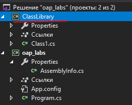
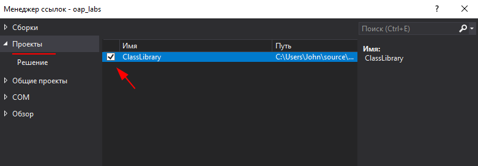

<table style="width: 100%;"><tr><td style="width: 40%;">
<a href="../articles/t6_templates.md">LINQ
</a></td><td style="width: 20%;">
<a href="../readme.md">Содержание
</a></td><td style="width: 40%;">
<a href="../articles/t7_dll.md">Библиотеки классов
</a></td><tr></table>

# Библиотеки классов

Нередко различные классы и структуры оформляются в виде отдельных библиотек, которые компилируются в файлы dll и затем могут подключать в другие проекты. Благодаря этому мы можем определить один и тот же функционал в виде библиотеки классов и подключать в различные проекты или передавать на использование другим разработчикам.

## Создание 

Возьмем имеющийся проект приложения .NET Framework, например, созданный в прошлых темах. В структуре проекта нажмем правой кнопкой на название решения и далее в появившемся контекстном меню выберем **Добавить -> Создать проект...**

Далее в списке шаблонов проекта найдем пункт **Библиотека классов (.NET Framework)**. Будьте внимательны, в списке шаблонов несколько вариантов "Библиотек классов" под разные платформы:


После создания проекта он появится в решении, в моем случае с названием ClassLibrary:



По умолчанию новый проект имеет один пустой класс **Class1** в файле `Class1.cs`. Мы можем этот файл удалить или переименовать, как нам больше нравится.

```cs
namespace ClassLibrary
{
    public class Class1
    {
    }
}
```

Например, переименуем файл `Class1.cs` в `Person.cs`, а класс **Class1** в **Person**. Определим в классе **Person** простейший код:

```cs
public class Person
{
    public string name;
    public int age;
}
```

>**ОБРАТИТЕ ВНИМАНИЕ!!!** Студия может создать класс без модификатора **public** - установите его, иначе не сможете использовать этот класс в других проектах.

Теперь скомпилируем библиотеку классов. Для этого нажмём правой кнопкой на проект библиотеки классов и в контекстном меню выберем пункт **Собрать**.

После компиляции библиотеки классов в папке проекта в каталоге `bin/Debug` мы сможем найти скомпилированный файл dll (ClassLibrary.dll).

## Подключение

Подключим созданную библиотеку классов в основной проект. Для этого в основном проекте нажмем правой кнопкой на **Ссылки** (раньше этот пункт назывался Зависимости) и в контекстном меню выберем пункт **Добавить ссылку...**:

Далее нам откроется окно для добавления библиотек. В этом окне выберем пункт **Проекты -> Решение**, который позволяет увидеть все библиотеки классов из проектов текущего решения и поставим отметку рядом с нашей библиотекой.



Если наша библиотека вдруг представляет файл dll, который не связан ни с каким проектом в нашем решении, то с помощью кнопки **Обзор** мы можем найти местоположение файла dll и также его подключить.

После успешного подключения библиотеки в главном проекте изменим класс **Program**, чтобы он использовал класс **Person** из библиотеки классов:

```cs
using System;
using ClassLibrary;    // подключение пространства имен из библиотеки классов
 
namespace HelloApp
{
    class Program
    {
        static void Main(string[] args)
        {
            Person tom = new Person { name = "Tom", age = 35 };
            Console.WriteLine(tom.name);
        }
    }
}
```
